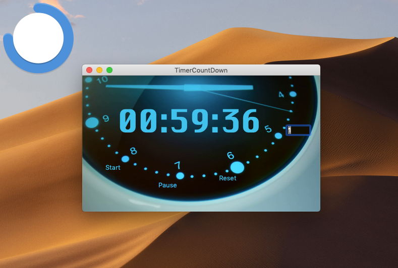
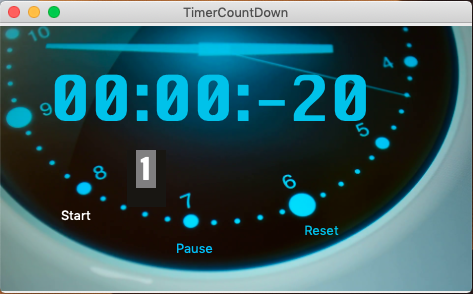

<a href="http://bitly.com/2grT54q"></a> 
 [](https://www.paypal.me/HAAW)


# A macOS x app to countdown seconds from a giving number of hours



Description 
================
TimerCountDown a small application that countdown time in seconds, an application that initiate me to swift and MacOs X Cocoa application.

HOW It WORKS
================

The application has many features, the deal is to avoid bugs and make sure that bugs never happens. when designing an user interactive application
A serie of bugs was avoided so far
### Bugfix : non digit User Input  :
The user edit the text zone and issue characters that are suppose to be digit.
a protection against filling no digit caracters including space has been added.

```swift
extension String {
    // detect if string holds numbers
    var isNumber: Bool {
        let characters = CharacterSet.decimalDigits.inverted
        return !self.isEmpty && rangeOfCharacter(from: characters) == nil
    }
    // clean white space
    func removingWhitespaces() -> String {
        return components(separatedBy: .whitespaces).joined()
    }
}

```

### Bugfix two  : Empty User Input  :
A default value was added in case of leaving the text box empty.

```swift
if hours.isEmpty || !hours.isNumber {
            hours = "1"
        }
```

### Bugfix two  : Click twice on start button  :
while tapping one time on start button run one counter, a second click on the button make runing a second time count that has as effect to randomly 
downcount in less that seconds. to fix this behaviour i added a varriable that hold the state of the counter. so 

```swift
var isTimerRunning = false
```
#MVC MVC and MVC
I make a choice to have an MVC implementation where the function runTimer() never embeed a condition inside. so the condition is ported to the button that trigger the runTimer.
this is a part of the MVC specification. the runTimer should be the Model, and we only interact on the view.


### bugfix tree : a negatif acount 

Since the updateTimer is doing a simple decrement. it's easy to run in a negative value after reaching the zero value.
So a small if statement was more that necessary 
```swift
if seconds != 0 {
            seconds -= 1
        }
```

### bugfix : Pause button stop working 
i got a surprise will using the pause button, this one was acting misteriously, like stop working after tree consecutive clicks, hanging after tapping the Reset button 
i decided to limit the button functionality to two basic cases : 
Pause the clock when the clock is runing : 
```swift
 if self.resumeTapped == false && self.isTimerRunning == true {
            timer.invalidate()
```
Resume the clock if the clock is not runing and the Pause button was already tapped :
```swift
 } else if self.resumeTapped == true && self.isTimerRunning == false {
          runTimer()
          
```